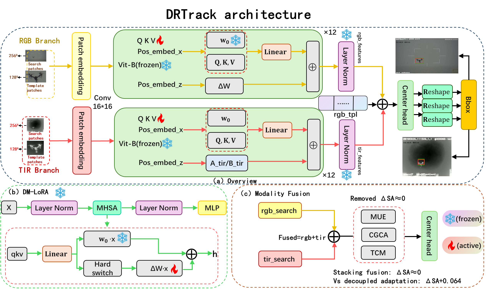

# DRTrack

**DRTrack: Decoupled Modality Low-Rank Adaptation for RGB-T Tracking**

---

## Status

This repository is currently a placeholder. The manuscript has been submitted to *IEEE Transactions on Circuits and Systems for Video Technology (TCSVT)* and is in the submission process.

The training code, model weights, and evaluation scripts will be released **upon paper acceptance**. Please stay tuned.

## Architecture

  

## Contact

Maintained by fengxuanling.

For questions and discussions, please open an issue in this repository.

## License

A permissive open-source license will be released together with the code upon paper acceptance.
